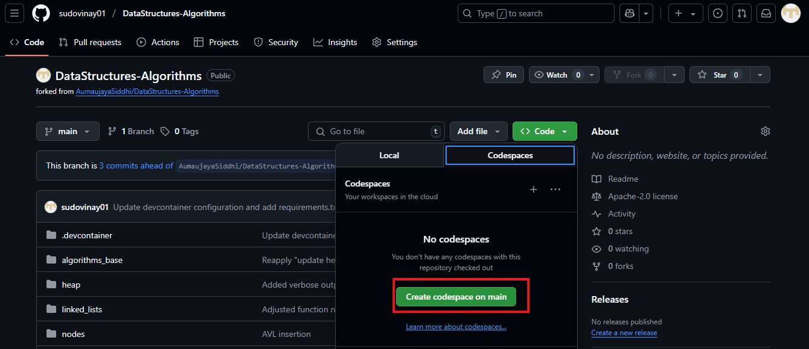

# DataStructures-Algorithms

A comprehensive collection of classic data structures and algorithms implemented in Python (with some Java). This repository is designed for learners, interview preparation, and anyone looking to strengthen their understanding of fundamental programming concepts.

---

## Features

- 📚 Implementations of common data structures (arrays, stacks, queues, linked lists, trees, etc.)
- ⚡️ Classic sorting algorithms (Quick Sort, Merge Sort, Insertion Sort, Bubble Sort, Selection Sort, and more)
- 🔍 Search algorithms (Binary Search, Linear Search, etc.)
- 🧠 Problem-solving patterns and algorithmic challenges
- 🏷️ Modular, well-documented, and easy-to-read code
- 📈 Educational utilities (verbose/debug modes for algorithm tracing)

---

## Folder Structure

```
.
├── sorting_algorithms/
│   ├── Sort.py
│   ├── quick_sort.py
│   └── ... (other sorting implementations)
├── data_structures/
│   ├── stack.py
│   ├── queue.py
│   └── ... (other data structures)
├── searching_algorithms/
│   ├── binary_search.py
│   └── linear_search.py
├── README.md
└── ... (other files and folders)
```

---

## Getting Started

### Prerequisites

- Python 3.x
- (Optional) numpy for some implementations

### Clone the Repository

```bash
git clone https://github.com/AumaujayaSiddhi/DataStructures-Algorithms.git
cd DataStructures-Algorithms
```

---

## Current Usage

1. Create the .py file of your name
2. import the required algorithm/data structures
3. Experiment with different algorithms.
4. Some scripts provide verbose or interactive modes. Check the file’s docstring or comments for usage details.

---

## Example: Using the Sort Class

```python
from sorting_algorithms.Sort import Sort

arr = [5, 3, 2, 8, 1]
sorter = Sort(arr)
sorter.apply(kind="merge", verbose=True)
sorter.displaySortedArray()
```

---

## Contributing

Contributions are welcome! Please open issues or pull requests for bug fixes, improvements, or new algorithms.

1. Fork this repository
2. Create a new branch (`git checkout -b feature/YourFeature`)
3. Commit your changes (`git commit -am 'Add new feature'`)
4. Push to the branch (`git push origin feature/YourFeature`)
5. Open a Pull Request

---

## Setup (Recommended: GitHub Codespaces)

The easiest way to get started is by using **GitHub Codespaces**:

1. Click the **"Code"** button on the repository page and select **"Open with Codespaces"**.
2. Wait for the Codespace to initialize. All dependencies (Python, pip, numpy, etc.) are pre-installed in the dev container.
3. Start coding right away! You can run scripts, open terminals, and use the pre-configured environment without any manual setup.

---


